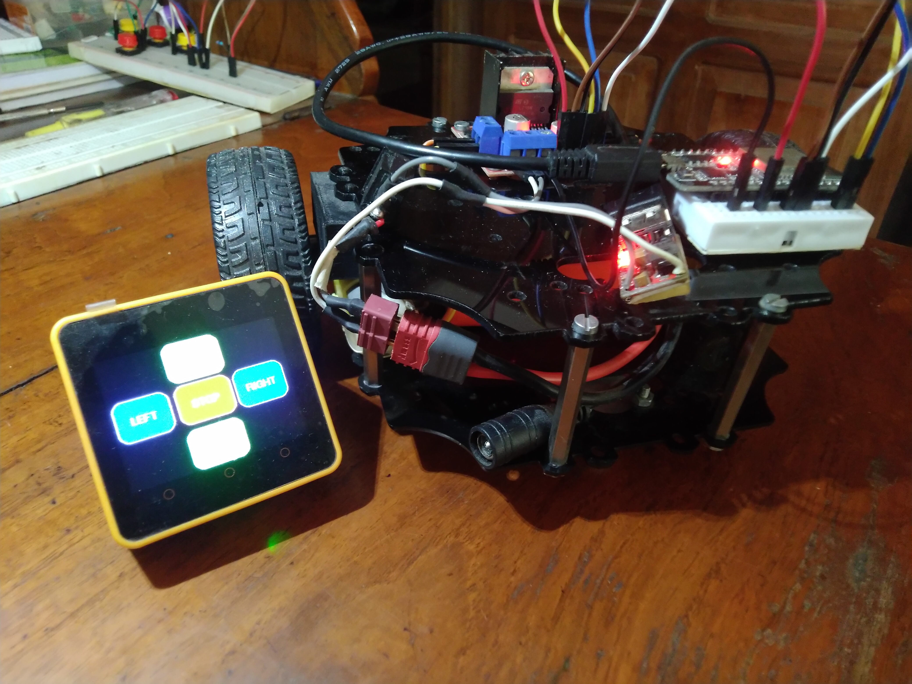
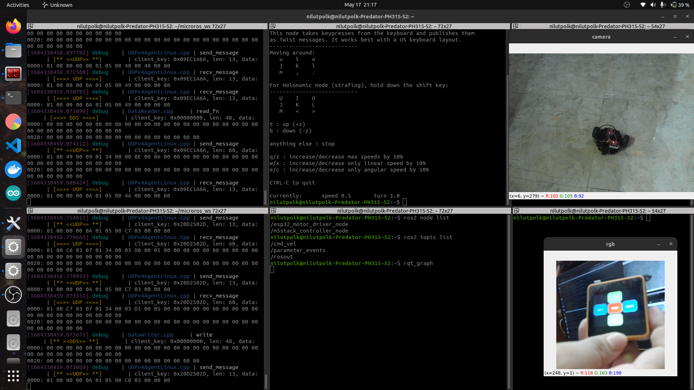
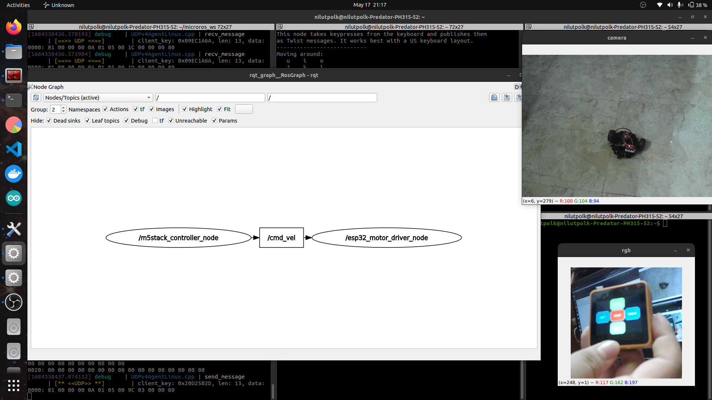
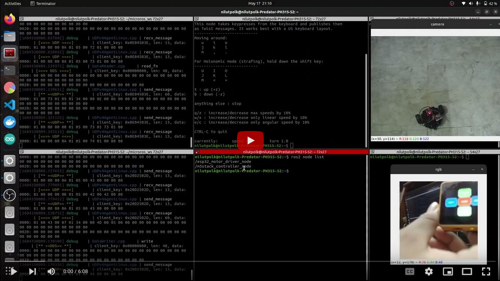

# micro-ros-robot-and-joystick
## Micro-ROS and ROS 2 based Differential Drive Robot and Touch-Screen Joystick

## Built By 
- [Nilutpol Kashyap](https://github.com/nilutpolkashyap)

  

 

___________________________________________________________________________

# **Details About Project**

## Differential Drive Robot

 

    ## Software Used
    - Arduino IDE
    - micro_ros_arduino library

    ## Hardware used 
    - ESP32 Dev Module 3.3V
    - Robot Base (TortoiseBot)

## M5Core2 Touch-screen Joystick

 

    ## Software Used
    - Arduino IDE
    - micro_ros_arduino library
    - M5Core2 library

    ## Hardware used 
    - M5Stack AWS-M5Core2 (ESP32)

## ROS 2 RQT graph

 

## Demo Video 

 

## Built By 
- [Nilutpol Kashyap](https://github.com/nilutpolkashyap)

